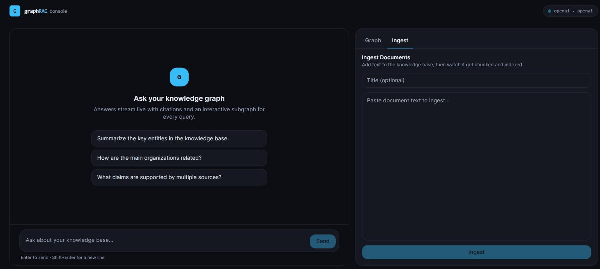
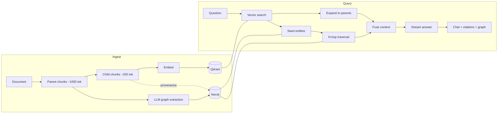

# Hierarchical GraphRAG

> Full-stack Retrieval-Augmented Generation that fuses **hierarchical (small-to-big) vector retrieval** with an **explicit Neo4j knowledge graph**, served through a streaming FastAPI backend and an interactive Next.js chat UI with a live graph inspector.

Ingest complex documents with parent–child hierarchical chunking, extract a typed
entity–relationship graph with an LLM, then answer questions by fusing vector
similarity with N-hop graph traversal — streaming grounded answers with
expandable citations and an interactive visualization of the subgraph used.


## Demo



*Ingesting a document, then asking a question — the answer streams live with expandable citations and the interactive knowledge subgraph used to ground it.*

---

## Contents

- [Demo](#demo)
- [Why GraphRAG](#why-graphrag)
- [Architecture](#architecture)
- [Quick start (one command)](#quick-start-one-command)
- [Using it](#using-it)
- [API](#api)
- [Configuration](#configuration)
- [Design trade-offs: accuracy ↔ latency](#design-trade-offs-accuracy--latency)
- [Testing & verification](#testing--verification)
- [Project layout](#project-layout)

---

## Why GraphRAG

Plain vector RAG retrieves passages that are *similar* to the query but is blind
to *relationships* between entities. This system adds a second, complementary
signal:

1. **Hierarchical vector retrieval** — embed small, precise **child** chunks
   (~200 tokens), then expand each hit to its larger **parent** block
   (~1000 tokens) for generation. Precision of small chunks, context of big ones.
2. **Knowledge-graph traversal** — extract typed relationships
   (e.g. `(Acme)-[ACQUIRED]->(Beta)`) into Neo4j and follow them N hops from the
   entities grounded in the retrieved chunks.

Both signals share **bidirectional provenance**: every graph node and edge
records the exact `parent_chunk_ids` **and** `child_chunk_ids` it came from, so
answers are auditable end-to-end.

## Architecture



Retrieval is orchestrated as a **LangGraph** pipeline
(`vector_search → seed_graph → traverse → build_context`). See
[`docs/architecture.md`](docs/architecture.md) for the full write-up.

| Layer         | Technology                                            |
| ------------- | ----------------------------------------------------- |
| Frontend      | Next.js · React · TypeScript · Tailwind · Cytoscape   |
| Backend       | FastAPI · Pydantic v2 · LangGraph · SSE streaming     |
| Vector store  | Qdrant                                                |
| Graph store   | Neo4j                                                 |
| LLM           | OpenAI (embeddings + generation) — pluggable          |
| Orchestration | docker-compose (UI + API + Neo4j + Qdrant)           |

## Quick start (one command)

**Prerequisites:** Docker + Docker Compose.

```bash
git clone https://github.com/SanoberRehman/hierarchical-graphrag.git
cd hierarchical-graphrag
cp .env.example .env
# Option A — real answers: put your key in .env  (OPENAI_API_KEY=sk-...)
# Option B — zero-key demo: set LLM_PROVIDER=fake and EMBEDDING_PROVIDER=fake in .env
docker compose up --build
```

Then open:

- **App:** http://localhost:3000
- **API docs (Swagger):** http://localhost:8000/docs
- **Neo4j Browser:** http://localhost:7474 (user `neo4j`, password `password`)

> **Zero-key mode is for wiring, not answer quality.** With `fake` providers the
> retrieval, citations, and knowledge subgraph are all real (derived from the text
> you ingest), but the generated *answer* is a fixed placeholder and relationships
> are generic `RELATED_TO`. Set `OPENAI_API_KEY` (Option A) for genuine,
> query-specific answers and typed relationships like `ACQUIRED` / `PARTNERED_WITH`.

> The browser calls the API at `http://localhost:8000`, which is the backend
> port published to your host — no extra config needed for the default setup.

## Using it

1. **Ingest** a document in the UI's ingest panel — click **Load sample** to drop
   in a ready-made corpus, or paste your own text (+ optional title), or use the
   API (below). Watch the job progress (parents, children, entities,
   relationships).
2. **Ask** a question. The answer streams token-by-token with:
   - **Citation cards** — expand to see the parent passages used (with scores).
   - **Graph triples** — the `(Source)-[TYPE]->(Target)` relationships used.
   - **Graph Inspector** — the interactive subgraph that grounded the answer.

### Sample queries

Click **Load sample** in the ingest panel (it loads the short corpus below) and
ingest it, then ask:

- "What did Acme Corporation acquire?"
- "How is Delta Systems connected to Gamma Ventures?"
- "Which companies partnered with each other?" *(names the `PARTNERED_WITH` edge —
  needs the OpenAI provider; in zero-key mode all edges are generic `RELATED_TO`.)*

The sample corpus (also what **Load sample** inserts):

> Acme Corporation acquired Beta Industries in a landmark deal. Acme Corporation
> also partnered with Gamma Ventures. Beta Industries invested in Delta Systems, a
> promising startup. Gamma Ventures added Delta Systems to its portfolio.

## API

Base URL `http://localhost:8000`. Full interactive docs at `/docs`.

```bash
# Ingest (async) -> returns a job_id
curl -s -X POST http://localhost:8000/api/v1/ingest \
  -H 'content-type: application/json' \
  -d '{"documents":[{"title":"Company Deals","text":"Acme Corporation acquired Beta Industries in a landmark deal. Acme Corporation also partnered with Gamma Ventures. Beta Industries invested in Delta Systems, a promising startup. Gamma Ventures added Delta Systems to its portfolio."}]}'

# Poll job status
curl -s http://localhost:8000/api/v1/ingest/jobs/<job_id>

# Chat (Server-Sent Events stream)
curl -N -X POST http://localhost:8000/api/v1/chat \
  -H 'content-type: application/json' \
  -d '{"query":"What did Acme acquire?"}'

# Subgraph used for a specific answer
curl -s "http://localhost:8000/api/v1/graph/subgraph?query_id=<query_id>"
```

The chat stream emits typed events in order:
`metadata` (carries `query_id`) → `citations` → `graph` → many `token` → `done`.

## Configuration

All settings are environment variables (see [`.env.example`](.env.example)). Key ones:

| Variable                       | Default                  | Purpose                              |
| ------------------------------ | ------------------------ | ------------------------------------ |
| `LLM_PROVIDER`                 | `openai`                 | `openai` or `fake` (offline)         |
| `EMBEDDING_PROVIDER`           | `openai`                 | `openai` or `fake` (offline)         |
| `OPENAI_API_KEY`               | —                        | Required when provider is `openai`   |
| `PARENT_CHUNK_TOKENS`          | `1000`                   | Parent chunk size                    |
| `CHILD_CHUNK_TOKENS`           | `200`                    | Child chunk size (embedded)          |
| `VECTOR_TOP_K`                 | `8`                      | Child matches per query              |
| `GRAPH_MAX_HOPS`               | `2`                      | Graph traversal depth                |

## Design trade-offs: accuracy ↔ latency

- **Small-to-big chunking.** Embedding small children maximizes retrieval
  precision; expanding to parents restores the context the LLM needs to answer
  well. Cost: two chunk tiers to store and an expansion lookup. Disjoint parents
  keep parent↔child provenance unambiguous.
- **Extraction at ingest, not query time.** Front-loading LLM extraction makes
  ingestion slower but keeps query latency low and answers consistent. The
  alternative (extract-on-query) is cheaper to ingest but slower and noisier to
  answer.
- **Bounded N-hop traversal (`GRAPH_MAX_HOPS`, default 2).** Deeper traversal
  surfaces more connections but grows the context and latency super-linearly, and
  risks diluting relevance. Two hops is a good default for most corpora.
- **`VECTOR_TOP_K` and parent expansion.** More child hits → higher recall but a
  larger, slower, costlier prompt. Grouping hits to unique parents caps prompt
  size while preserving coverage.
- **Pluggable providers.** OpenAI maximizes extraction/answer quality; the
  deterministic `fake` providers trade quality for zero-setup, instant, offline
  runs (and make the pipeline testable in CI without a key).

## Testing & verification

- **Unit tests** (no services): chunking invariants, provenance direction,
  retrieval helpers, the fakes. `pytest -m "not integration"`.
- **Integration tests** (live Neo4j + Qdrant): full ingest → vector search →
  N-hop graph traversal, the ASGI API (async ingest, SSE stream, subgraph
  endpoints), and idempotent re-ingest. Run in **CI** via GitHub Actions service
  containers with the deterministic fake providers.
- **Frontend**: `npm run lint` + `npm run build` in CI.

> Honest note: the full four-container stack and *real* LLM answer quality are
> validated with a Docker environment and an OpenAI key. CI verifies the entire
> ingest→graph→chat pipeline and the API end-to-end using the deterministic fake
> providers; anything requiring a live model is validated manually and labeled as
> such rather than claimed as automatically verified.

## Project layout

```
backend/     FastAPI app: config, models, core (chunking/provenance), services
frontend/    Next.js chat UI with citations + Cytoscape graph inspector
tests/       Unit + integration tests (pytest)
docs/        Architecture write-up and diagrams
docker-compose.yml
```

## License

[MIT](LICENSE) © Sanober Rehman
