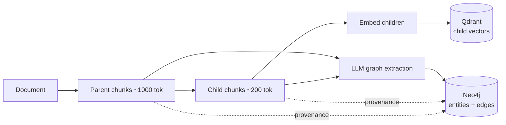
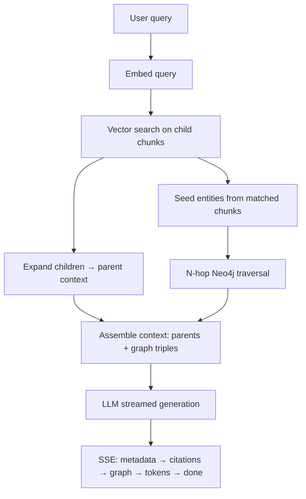

# Architecture

Hierarchical GraphRAG fuses **two retrieval signals** over the same corpus:

1. **Hierarchical vector retrieval** — precise child-chunk matching that expands
   to parent context ("small-to-big").
2. **Knowledge-graph traversal** — explicit, typed entity relationships that let
   the system follow multi-hop connections a pure vector search would miss.

Both signals are grounded in the *same* chunks through **bidirectional
provenance**, so every graph node/edge can point back to the passages it came
from and every retrieved passage can surface the relationships it participates in.

## Components

| Component      | Role                                                                 |
| -------------- | ------------------------------------------------------------------- |
| **Chunker**    | Splits documents into ~1000-token parents and ~200-token children.  |
| **Extractor**  | LLM structured output → entities + typed relationships per chunk.   |
| **Vector store** (Qdrant) | Stores child-chunk embeddings + payloads for ANN search. |
| **Graph store** (Neo4j)   | Stores entities/relationships with chunk provenance.     |
| **Retriever**  | LangGraph agent: vector search → parent expansion → N-hop traversal. |
| **API** (FastAPI) | Async ingest, SSE chat streaming, subgraph endpoint.             |
| **Frontend** (Next.js) | Streaming chat, citation cards, Cytoscape graph inspector.  |

## Provider abstraction

`EmbeddingProvider` and `LLMProvider` are Protocols with two implementations
each: an **OpenAI** production provider and a **deterministic fake**. The fake
embedder is a hashing bag-of-words embedder (unit-normalized, so cosine
similarity is meaningful); the fake LLM extracts capitalized phrases as entities
and chains them into relationships. This makes the *entire* ingest → graph → chat
path runnable and assertable with **no API key**, which is how CI verifies the
system end-to-end (see below).

## Ingestion flow

`POST /api/v1/ingest` accepts documents, returns a `job_id` immediately, and runs
the pipeline in the background. Job status is pollable.

## Chat / retrieval flow

`POST /api/v1/chat` streams a typed SSE event sequence:
`metadata` (carries `query_id`) → `citations` (parent chunks) → `graph`
(subgraph + triples) → many `token` events → `done`. The `query_id` lets the
frontend later fetch the exact subgraph used via
`GET /api/v1/graph/subgraph?query_id=...`.

## Design trade-offs (accuracy ↔ latency)

* **Small-to-big chunking** buys precision (embed small) *and* context (generate
  big) at the cost of storing two chunk tiers and an expansion lookup.
* **Graph extraction at ingest** front-loads LLM cost so query time stays fast;
  the alternative (extract-on-query) is cheaper to ingest but slower and less
  consistent to answer.
* **N-hop depth** is capped (`GRAPH_MAX_HOPS`, default 2): deeper traversal finds
  more connections but grows the context and latency super-linearly.
* **Provider abstraction** lets a reviewer trade quality for zero-setup: the fake
  providers run instantly offline; OpenAI providers maximize extraction/answer
  quality.

A fuller write-up (chosen defaults, measured trade-offs) lands with the API and
docker-compose PRs.

## Verification strategy

There is no Docker or OpenAI key on the original dev machine, so the project's
real end-to-end verification runs in **GitHub Actions**: the `integration` job
starts Neo4j and Qdrant as service containers and exercises ingest → graph →
chat with the deterministic fake providers. Unit tests (chunking, provenance,
fakes) run without any services. Anything requiring a live LLM (answer quality,
real extraction) is validated manually with a key and is called out as such —
never reported as automatically verified.
